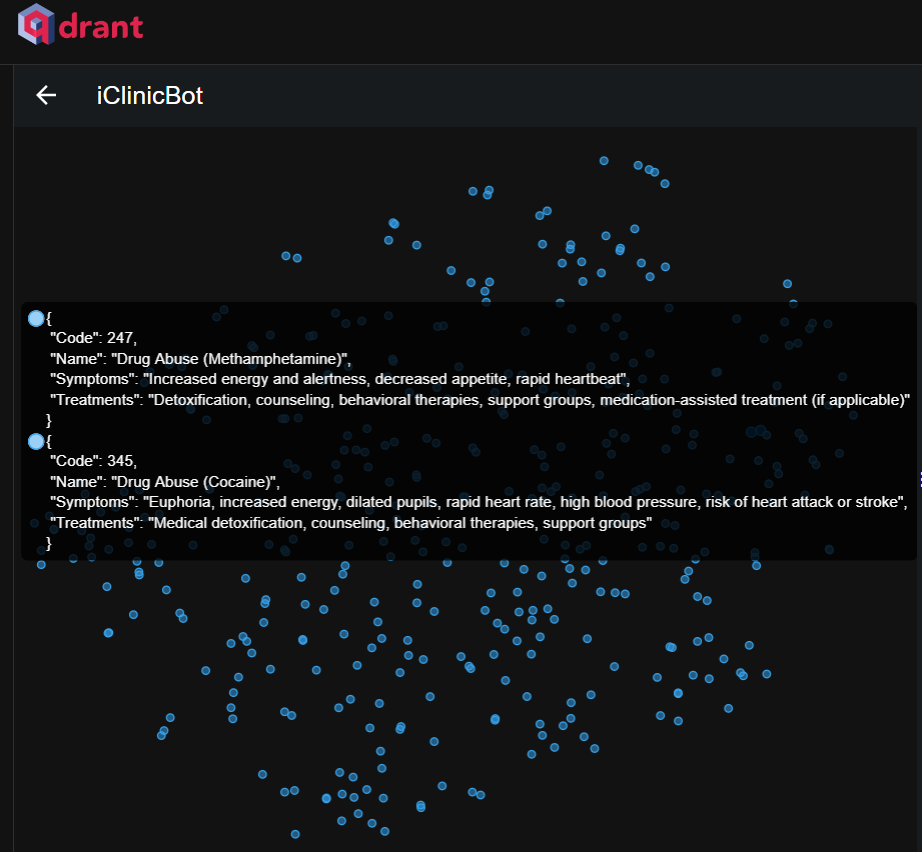
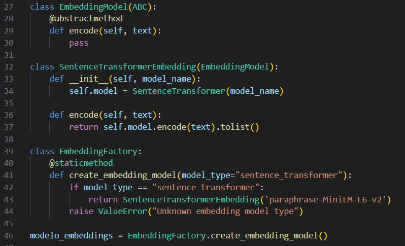

# ChatLlamaAPI (backend)

## Descrição

Link GitHub: [https://github.com/FERNANDO-MATSUHASHI/ChatLlamaAPI-QDrant.git](https://github.com/FERNANDO-MATSUHASHI/ChatLlamaAPI-QDrant.git). <br>

Uma API em python para acessar a inteligência artificial do Llama 3.1-8b com reforço com o Banco de Dados vetorial que está hospedado em QDrant.

## Tecnologias

- Python Version: 3.11.9

## Como funciona
Aqui explicarei como funciona o ChatLlamaAPI

### QDrant (Banco Vetorial)


### Padrão de Projeto Aplicado - Factory Method


## Configuração do Projeto

### Instale o Pyhton

Link: [https://www.python.org/downloads/](https://www.python.org/downloads/). <br>


### Instale as dependências

```bash
pip install --user -r requirements.txt
```

#### Rodar o projeto

```bash
python3 llamaAPI.py
```
